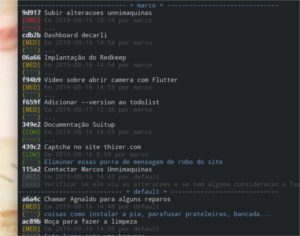
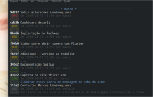

# todolist - Lista de tarefas simples

Este aplicativo foi feito com intuito de ter um gerenciador
de tarefas simples que pudesse ler um arquivo no formato JSON.
Este arquivo pode ficar em um servidor compartilhado tornando
assim possível que um colaborador possa criar tarefa para outro
e vice-versa.

> Ps.: No terminal `$` significa que estamos usando um usuário comum (não root)

## Install

Apenas baixe o arquivo `todolist.deb` [aqui no github](https://github.com/thizer/todolist/releases/latest) e instale usando o comando:

`$ sudo dpkg -i ~/Downloads/todolist.deb`

> Assumindo que você baixou o arquivo na sua pasta downloads...

## Build

Get in project document root 

`$ /usr/lib/dart/bin/dart2aot bin/main.dart build/todolist`

`$ sudo dpkg-deb -b build/ /home/user/Documentos/`

## Dart

Outra questão interessante é que ele foi completamente construído
através do Dart que é uma linguagem de programação fantástica
desenvolvida pelo Google. [https://dartlang.org](https://dartlang.org)

Created from templates made available by Stagehand under a BSD-style
[license](https://github.com/dart-lang/stagehand/blob/master/LICENSE).
